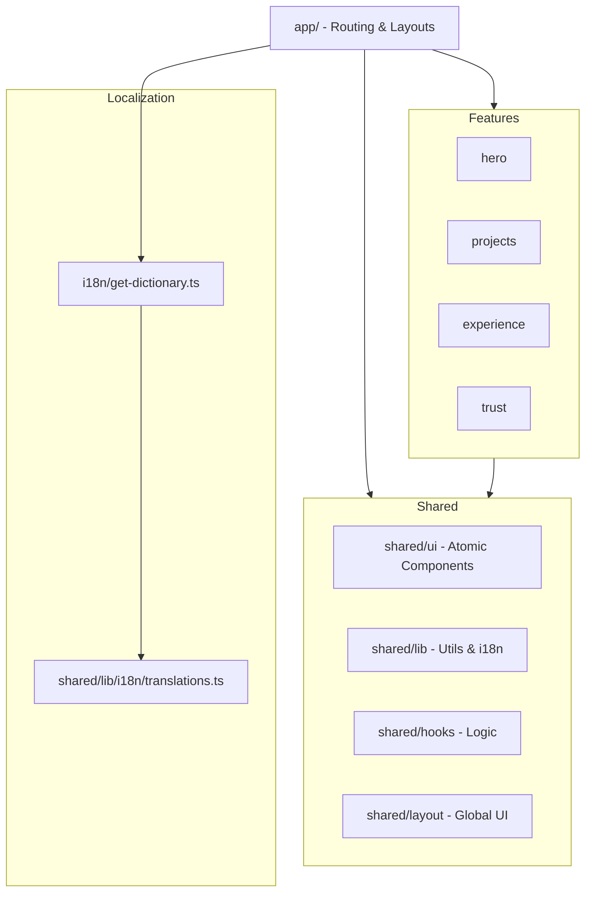

# Isllan Toso | Portfolio

Modern, high-performance personal portfolio built with Next.js 16, React 19, and Tailwind CSS 4. Designed for speed, accessibility, and seamless user experience.

---

## Architecture Overview

This project follows a feature-based architecture (Vertical Slicing), separating concerns into modular features and a shared infrastructure layer.



---

## Tech Stack

- Framework: [Next.js 16](https://nextjs.org/) (App Router)
- Library: [React 19](https://react.dev/)
- Styling: [Tailwind CSS 4.2+](https://tailwindcss.com/)
- Animations: [Framer Motion 12](https://www.framer.com/motion/)
- Internationalization: Dictionary-based i18n (i18n/get-dictionary.ts)
- Components: Radix UI & shadcn/ui
- Icons: Lucide React
- Deployment: [Vercel](https://vercel.com)

## Project Structure

```text
├── app/              # Next.js App Router (Layouts, Pages, Globals)
├── features/         # Verticalized feature-based sections (Hero, Projects, etc.)
├── shared/           # Reusable components and logic
│   ├── layout/       # Shared Header, Footer, etc.
│   ├── ui/           # Atomic UI components (shadcn/ui style)
│   ├── lib/          # Utilities and core business logic
│   └── hooks/        # Custom React hooks
├── i18n/             # Localization dictionary loader
├── public/           # Static assets (images, icons)
└── styles/           # Global styles
```

## Getting Started

### 1. Prerequisites
Ensure you have Node.js 20+ and npm (or pnpm/yarn) installed.

### 2. Installation
```bash
npm install
```

### 3. Development
```bash
npm run dev
```
Open [http://localhost:3000](http://localhost:3000) to view it in the browser.

### 4. Build
```bash
npm run build
npm run start
```

## Localization (i18n)

This project uses a dictionary-based i18n system.
1. Translation data is in shared/lib/i18n/translations.ts.
2. Components receive a dict prop with the necessary strings.
3. Server components use getDictionary(locale) from i18n/get-dictionary.ts.

## Styling

We use Tailwind CSS 4, which leverages modern CSS features. Global variables and base styles are located in app/globals.css.

---

## Contributing

This project is personal, but feel free to fork and adapt it for your own use. If you find any bugs or have suggestions, open an issue!

## License

[MIT](./LICENSE) © Isllan Toso Pereira
